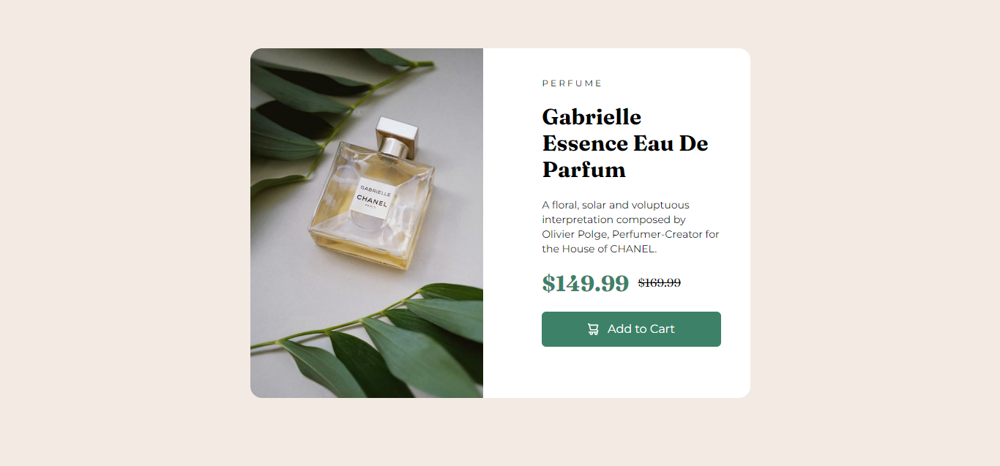
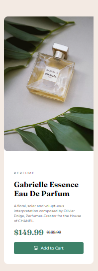

# Tailwind CSS Showcase

**Responsive design**:

A basic React application demonstrating the use of Tailwind CSS for styling and responsiveness, featuring Gabrielle Essence Eau De Parfum, a luxurious perfume by CHANEL.

## About the Project

This project aims to showcase the capabilities of Tailwind CSS in building a responsive and visually appealing website. The application displays a product offer for Gabrielle Essence Eau De Parfum, highlighting its features and providing a call-to-action for adding to cart. The design was taken from the **[Frontend Mentor](https://www.frontendmentor.io/challenges/news-homepage-H6SWTa1MFl)** website

## Features

* Responsive design using Tailwind CSS utility-first approach
* Mobile-friendly layout with easy-to-read typography
* Attractive product showcase with image and detailed description
* Call-to-action button for adding to cart

## Technologies Used

* React.js for building the application
* Tailwind CSS for styling and responsiveness
* JavaScript for dynamic functionality
* FrontendMentor website to follow the proposed design

## Getting Started

1. Clone the repository: `git clone https://github.com/devHyrum/Tailwind-CSS-Showcase.git`
2. Install dependencies: `npm install` or `yarn install`
3. Start the application: `npm start` or `yarn start`
4. Open your web browser and navigate to `http://localhost:3000`

## Contributing

Contributions are welcome! If you'd like to contribute to this project, please fork the repository, make your changes, and submit a pull request.